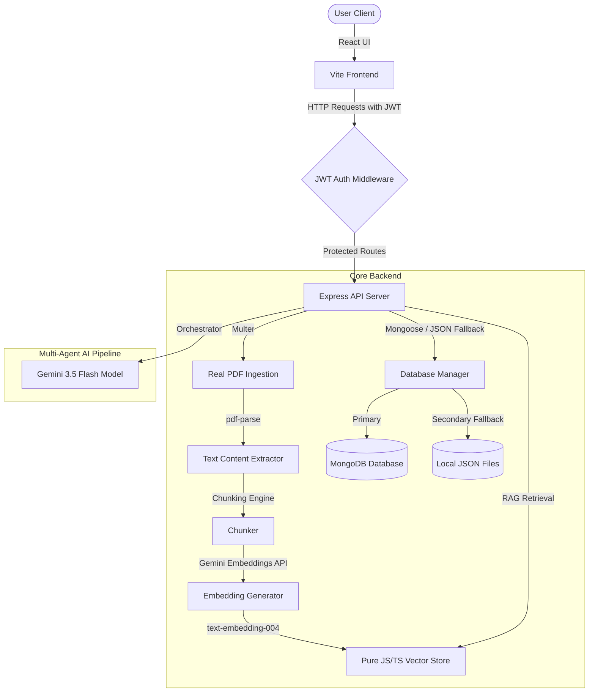

# Multi-Agent Customer Support Assistant using RAG

A state-of-the-art customer support assistant leveraging Retrieval-Augmented Generation (RAG) and Gemini 3.5 AI orchestration to automatically route, analyze, retrieve, and synthesize responses for incoming queries.

---

## 📖 Table of Contents
1. [Key Features](#-key-features)
2. [System Architecture](#-system-architecture)
3. [REST API Documentation](#-rest-api-documentation)
4. [Getting Started (Local Development)](#-getting-started-local-development)
5. [Running with Docker Compose](#-running-with-docker-compose)
6. [Running Automated Tests](#-running-automated-tests)

---

## 🌟 Key Features

*   **Real PDF & TXT Ingestion**: Ingest and parse PDF/TXT manuals directly on the frontend using `multer` and `pdf-parse`.
*   **Semantic Vector Store (Pure JS Cosine Similarity)**: Performs fast cosine similarity matching. Generated embeddings are mapped using Gemini's latest `text-embedding-004` model.
*   **MongoDB & Mongoose Integration**: Persists users, knowledge documents, chunks, and conversation histories.
*   **Automatic Local Fallback**: If a MongoDB database connection is not reachable, the server automatically falls back to an internal JSON-file database, guaranteeing 100% runtime reliability.
*   **JWT User Authentication**: Sleek register/login mechanism securing all core agent orchestration endpoints.
*   **Multi-Agent Decision Tree**: Routes queries dynamically to Billing, Tech Support, FAQ, Product, and Complaint agents. Resolves and compiles final answers via a response aggregator.
*   **Fallback Rule Engine**: If the Gemini API key is missing or quota is exceeded, the server automatically falls back to rules-based keyword classification and semantic scoring.

---

## 🏗️ System Architecture



---

## 📡 REST API Documentation

### Public Endpoints
*   `GET /api/health`: Health status check showing if Gemini is active.
*   `POST /api/auth/register`: Create a new user credentials profile. Body: `{ "username": "...", "password": "..." }`
*   `POST /api/auth/login`: Authenticate and sign a session token. Body: `{ "username": "...", "password": "..." }`

### Protected Endpoints (Requires `Authorization: Bearer <JWT_TOKEN>`)
*   `GET /api/knowledge-base`: Fetch loaded documents and chunks sample.
*   `POST /api/knowledge-base/upload`: Copy-paste raw text contents. Body: `{ "name": "...", "content": "...", "category": "..." }`
*   `POST /api/knowledge-base/upload-file`: Upload PDF/TXT file as multipart/form-data with a `category` text field.
*   `POST /api/knowledge-base/search`: Query the vector database sandbox. Body: `{ "query": "..." }`
*   `GET /api/analytics`: Fetch metrics, CSAT scores, sentiment trends, and agent distribution.
*   `POST /api/chat`: Process query through RAG and agent orchestration. Body: `{ "query": "..." }`
*   `POST /api/chat/feedback`: Submit a CSAT star rating for a message. Body: `{ "conversationId": "...", "messageId": "...", "rating": 5 }`
*   `POST /api/simulation/run`: Populate database with automated simulated conversations.
*   `POST /api/simulation/reset`: Reset conversation history data to default preset records.

---

## 🚀 Getting Started (Local Development)

### Prerequisites
*   Node.js (v18+)
*   MongoDB running locally on default port `27017` (Optional, as the application will automatically fall back to local JSON file storage if MongoDB is missing).

### Installation & Run

1.  **Install dependencies**:
    ```bash
    npm install
    ```
2.  **Configure Environment Variables**:
    Create a `.env` file in the root directory:
    ```env
    GEMINI_API_KEY="your-gemini-api-key-here"
    MONGO_URI="mongodb://localhost:27017/support_rag"
    JWT_SECRET="a_secure_custom_secret_key"
    ```
3.  **Run in Dev Mode**:
    ```bash
    npm run dev
    ```
    Open [http://localhost:3000](http://localhost:3000) to see the dashboard.
    *Note: A default administrator account `admin / admin123` is automatically seeded for easy initial login.*

---

## 🐳 Running with Docker Compose

Ensure Docker and Docker Compose are installed on your host system:

1.  **Configure environment values** in `.env` (ensure `GEMINI_API_KEY` is set).
2.  **Spin up containers**:
    ```bash
    docker-compose up --build
    ```
    This builds the application container and launches a paired, volume-persisted MongoDB container.
3.  **Access the application** at [http://localhost:3000](http://localhost:3000).

---

## 🧪 Running Automated Tests

Run the built-in Jest-like tests using Node's native test runner:

```bash
npm run test
```

This runs:
*   Cosine similarity math verification.
*   Bcrypt password hashing and validation checks.
*   JWT token issuance and tampering security checks.
*   Database adapter connectivity fallback tests.
